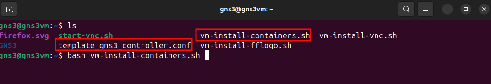

# Scripts

## Setting up GNS3 VM

Download/copy the following scripts into the GNS3 VM inside ``/home/gns3``, then run them. Make sure you have the .sh script and the ``template_gns3_controller.conf`` file in the GNS3 VM.


)

### Install Logos

Some logos are not included in the standard directory. This downloads them and puts them in the correct directory:

```
bash vm-install-logos.sh
```


### Install noVNC

NoVNC allows access to VNC node in the web browser (avoiding need for students to install VNC client). This installs noVNC in GNS3 VM and creates a simple script that can be run when needed:

```
bash vm-install-vnc.sh
```


### Install Docker Containers

Install Docker containers, for a Windows/Linux host:

```
bash vm-install-containers.sh pc
```



or for an Apple Mac host:

```
bash vm-install-containers.sh mac
```

### Install Qemu VMs

Download the Qemu VM images, for a Windows/Linux host:

```
bash vm-isntall-qemuvms.sh pc
```

or for an Apple Mac host:

```
bash vm-isntall-qemuvms.sh mac
```

### Install Templates

Update the tempplates for all Docker and Qemu images installed:

```
bash vm-install-templates.sh all
```

or if only Docker container templates needed:

```
bash vm-install-templates.sh docker
```

or if only Qemu VM templates needed:

```
bash vm-install-templates.sh qemu
```
