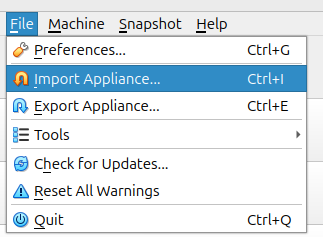
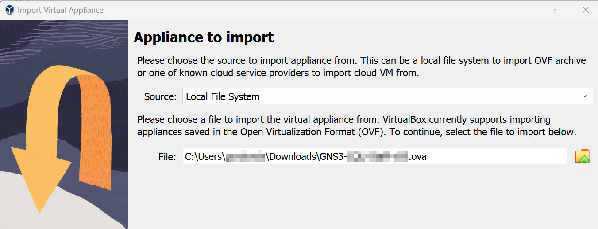
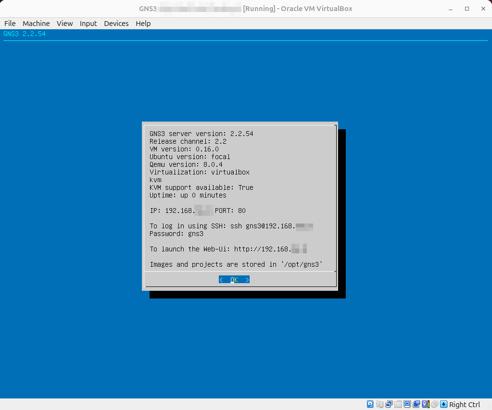
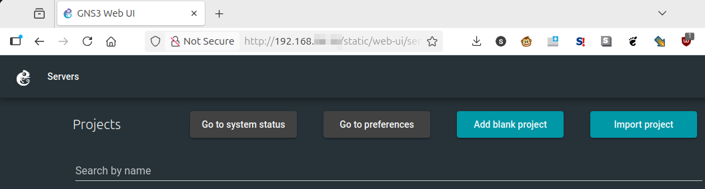

# Getting Started with GNS3 VM on a PC

Here are quick instructions for getting GNS3 running as a Virtual Machine (VM) in a PC running Windows or Linux. There are different instructions for [getting started with an Apple Mac](./getting-started-mac.md).

These are written for CQUniversity students.

## What do you need?

- VirtualBox virtualisation software. This is likely already installed on a lab computer. If you are using your personal computer (e.g., laptop) then you can [download and install VirtualBox](https://www.virtualbox.org/) yourself. We are using version 7, so the latest version 7 for Windows should be sufficient.
- GNS3 VM Appliance. This is a ``.ova`` file. It is usually multiple GB in size. Your teacher will tell you where to download the ``.ova`` file from. 
- A web browser, e.g., Firefox, Edge, Chrome on Windows.

In the following we assume you have VirtualBox running successfully and have downloaded the GNS3 VM Appliance (``.ova`` file).

## Import the Appliance into VirtualBox

Start VirtualBox and from the *File* menu select *Import Appliance*:



Select the GNS3 VM Appliance file (``.ova``) that you downloaded to import:



Click *Next*. The default settings should be ok. You may check the Machine Base Folder in case you want the VM saved in a different location (but the default should be fine).

Click *Finish* and the import will start. It may take a few minutes to complete.

## Start the GNS3 VM

In VirtualBox select the new GNS3 VM and *Start* the VM. It may take several minutes to boot. Eventually you will see a blue screen with a grey information box:



Take note of the IP address shown. It may be different across different users, and it may change if you add/delete/import other VMs in VirtualBox.

## Access the GNS3 User Interface with Your Web Browser

Open your web browser on Windows and visit the IP address from the previous step. That is, in your web browser address bar type in:
```
http://192.168.x.y/
```

**Note carefully** it is *http* (not *https*) and the actual IP address must be given (replace x and y with your values).

Also note that this is done on your web browser in Windows, not inside VirtualBox. 

You should see the main GNS3 UI, such as:


You may see a list of pre-loaded projects. If so, click on one to get started using that project. Alternatively, you can import projects (``.gns3project`` files).

You are now ready to use GNS3!