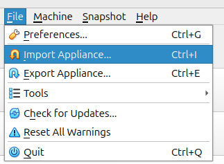
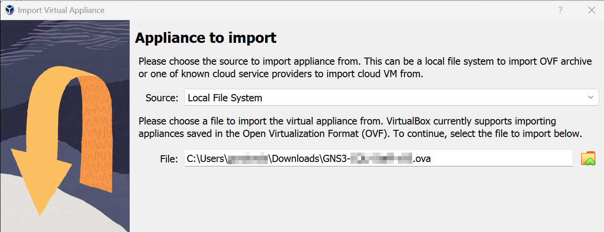
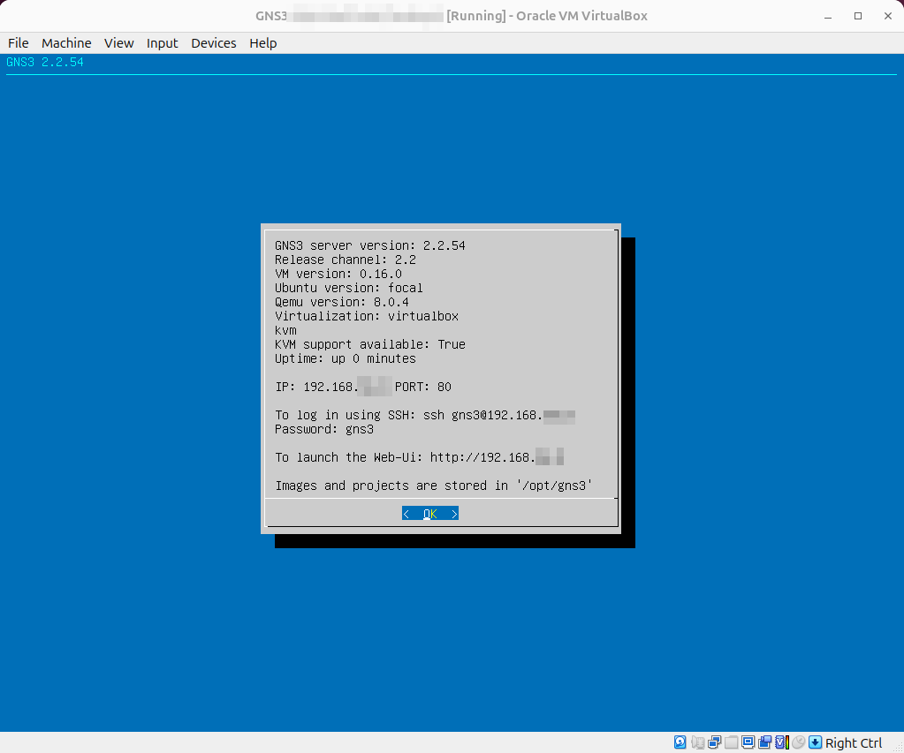
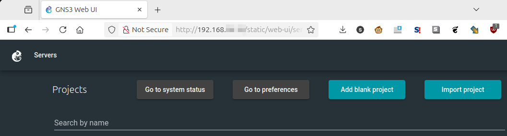

# Getting Started with GNS3 VM on a PC

Here are quick instructions for getting GNS3 running as a Virtual Machine (VM) in a PC running Windows or Linux. There are different instructions for [getting started with an Apple Mac](./getting-started-mac.md).

**At CQU:** most computer labs have VirtualBox installed already, your unit's Moodle site has
the download link for the appliance and the project files for your activities, and staff can
install VirtualBox on a CQU laptop through the Company Portal.

## What do you need?

- **VirtualBox virtualisation software**. This is likely already installed on a lab computer. If you are using your personal computer (e.g., laptop) then you can [download and install VirtualBox](https://www.virtualbox.org/) yourself. We are using version 7, so the latest version 7 for Windows should be sufficient.
- **GNS3 VM Appliance**. This is a ``.ova`` file, usually several GB in size. At CQU your unit site has the download link; otherwise see the [repository README](../README.md) for where to get it or how to build it. 
- **A web browser**, e.g., Firefox, Edge, Chrome on Windows.

In the following we assume you have VirtualBox running successfully and have downloaded the GNS3 VM Appliance (``.ova`` file).

## Import the Appliance into VirtualBox

Start VirtualBox and from the *File* menu select *Import Appliance*:



Select the GNS3 VM Appliance file (``.ova``) that you downloaded to import:



Click *Next*. The default settings should be ok. You may check the Machine Base Folder in case you want the VM saved in a different location (but the default should be fine).

Click *Finish* and the import will start. It may take a few minutes to complete.

## Start the GNS3 VM

In VirtualBox select the new GNS3 VM and *Start* the VM. It may take several minutes to boot. Eventually you will see a blue screen with a grey information box:



Take note of the IP address shown. It may be different across different users, and it may change if you add/delete/import other VMs in VirtualBox.

## Access the GNS3 Web Interface with Your Web Browser

Open your web browser on Windows and visit the IP address from the previous step. That is, in your web browser address bar type in:
```
http://192.168.x.y/
```

**Note carefully** it is *http* (not *https*) and the actual IP address must be given (replace x and y with your values).

Also note that this is done on your web browser in Windows, not inside VirtualBox. 

You should see the main GNS3 UI, such as:


You will see a list of pre-loaded projects. These are demonstrations – click on one to have a look around. The projects for your activities are downloaded separately and imported, which is described in [Importing a Project](./using-gns3.md#importing-a-project). At CQU they are on your unit's Moodle site.

You are now ready to use GNS3!

## Check which appliance you have

Appliances are replaced each term, and a renamed `.ova` proves nothing. To see which one you are
running, open the VM's own shell (from the GNS3 VM menu in VirtualBox, choose *Shell*) and run:

```
cat /etc/gns3-cqu-release
```

The same line appears in the information screen when you log in. If it does not match the release
you were told to use this term, you are on an old appliance — download the current one and delete
the old virtual machine.

## Using a real Windows machine as a lab node

A GNS3 topology can include your own Windows machine, running beside the GNS3 VM, so you can
test Windows firewall behaviour, file sharing, Remote Desktop or Wireshark on Windows against
the rest of a topology. It appears on the canvas as a node called **Windows Host**.

This is optional and no activity needs it unless yours says so. Setting it up is a separate
guide, which your unit will point you at if it is used.

## If something goes wrong

Import failures, a VM that will not start, and nodes that fail or misbehave once running are
covered in [Troubleshooting](./troubleshooting.md).
