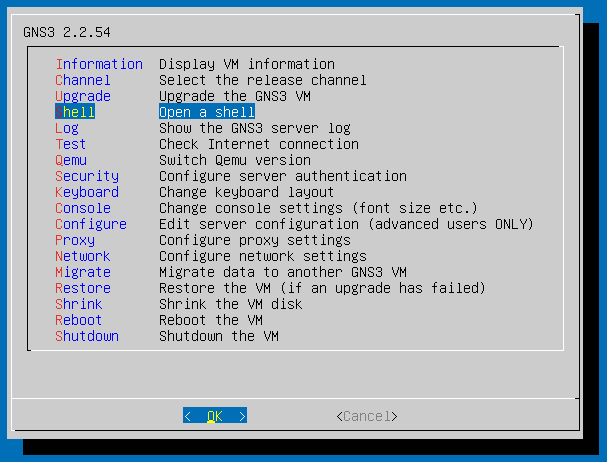
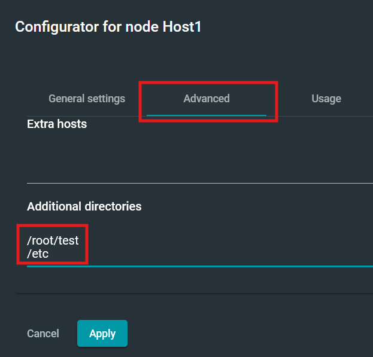

# Guide: Saving Your Work in GNS3

This guide explains why configuration you type into a GNS3 node can disappear, what you need to do
once so that it stops happening, and what an exported project does and does not contain.

It applies to the Docker nodes in GNS3 – Linux Host, Linux Router, VPN Router, Ansible Host, Ubuntu
Host, Kerberos Host and Suricata IDS. Nodes that run a full virtual machine, such as OPNsense, keep
their own disk and are not affected.

This is a practical guide only. It does not tell you what network to build or what to submit – that
comes from your own unit's activity instructions.

## What Is Saved and What Is Not

A Docker node is not a computer with a hard disk. It is built fresh from a stored image, and GNS3
keeps only the directories it has been told to keep. Everything else lives in the running node and
disappears when that node is rebuilt.

Three things behave differently, and the difference matters:

- **Stopping and starting a node** keeps everything. The node is paused, not rebuilt.
- **Closing a project and opening it again** rebuilds every node from its image. Anything outside a
  kept directory is gone.
- **Restarting or shutting down the GNS3 VM** has the same effect as closing the project.

Out of the box, only a small number of directories are kept – `/etc/ssh`, `/root/.ssh`, `/data` and
`/home/student`. That is why work such as a certificate authority under `/root`, a WireGuard key in
`/etc/wireguard`, a user account in `/etc/shadow` or a Kerberos database in `/var/lib/krb5kdc` is
lost when you close a project, even though your `sshd_config` survives.

There is one more thing that is never kept, no matter what you do: **running programs**. A web
server, `suricata`, a listener you started with `nc`, or the SSH daemon are processes, not files.
After you open a project again you must start them again, even when their configuration files are
exactly as you left them.

## Set Up Persistence Once

You only need to do this once. It tells GNS3 to keep the directories the unit activities actually
write to, for every node you create from then on.

**Check first, because a newer virtual machine already does this.** From the VM shell (see below),
run `sh ~/git/gns3/server/vm-fix-persistence.sh --list`. If the node types already have directories
listed beside them, there is nothing for you to do and you can skip to the next section.

Start the GNS3 VM and open its console – the window VirtualBox shows for the virtual machine, not a
node console inside GNS3. From the menu, choose **Shell**, then **OK**.



At the shell prompt, update the copy of the course repository that is already on the VM, then run
the script:

```
cd ~/git/gns3
git pull
sh server/vm-fix-persistence.sh
```

It prints one line per node type as it goes, and finishes with a short summary. Running it a second
time is harmless – it reports that everything is already correct and changes nothing.

If you would rather see what it would do before it does anything, run
`sh server/vm-fix-persistence.sh --dry-run` first, or `sh server/vm-fix-persistence.sh --list` to
show the current setting for every node type.

The GNS3 VM needs internet access for `git pull` to work. This is normally already the case,
through the VirtualBox NAT adapter.

## Projects You Have Already Built

The script changes the node types, so it applies to nodes you create **after** running it. Nodes in
a project you have already built are not changed.

If you have an existing project you want to keep working in, you have two choices. The simpler one
is to build the project again – for most activities this takes a few minutes, and the configuration
inside it was not being kept anyway. The alternative is to set the directories by hand on each node:

1. Stop the node.
2. Right-click the node and choose *Configure*.
3. Open the *Advanced* tab and find *Additional directories*.
4. Add one directory per line. For most nodes use `/etc`, `/root`, `/var/www` and `/usr/local/bin`.
5. Click *Apply*, then start the node again.



The same steps are how you fix a single node at any time, for example if you add one node to a
project you built earlier.

## Give a Node Its Name Before You Start It

One of the kept directories is `/etc`, and `/etc` holds the `hosts` file – the small table a node
uses to look up names, including its own. That file is written once, the first time the node starts,
with whatever the node was called at that moment.

So if you rename a node after it has run, the name in the topology changes but the name inside the
file does not. The node keeps answering to its new name, but looking up that name on the node itself
fails, and some commands print a warning about being unable to resolve the host.

Label your nodes as you add them, before you start them. If you do rename one later and see that
warning, open the node console and edit the first line of `/etc/hosts` – the one on `127.0.1.1` – to
the new name.

## What an Exported Project Contains

Exporting a project writes a single `.gns3project` file containing the topology – the nodes, how
they are connected, and their settings – together with the contents of every kept directory.

Once you have set up persistence, an export therefore contains your actual configuration, and
importing that file on another computer gives you your work back. This makes the export worth
keeping as your own record, and it is a habit worth having regardless of what any particular
activity asks you to submit.

Two things are worth knowing. First, an export contains private keys if your activity created any –
treat the file as something you would not post publicly. Second, an export never contains running
programs, so after importing you always start the services again.

To export, right-click the project name and choose the export option, then save the file somewhere
outside the GNS3 VM.

## Starting a Node Again From Scratch

Keeping configuration has a cost. A mistake is now kept as faithfully as a success, so a broken
`sshd_config` or a half-finished database follows you into the next session instead of being cleared
when you open the project again.

When a node is in a state you cannot untangle, the quickest fix is to start it again from scratch:
delete the node, then add a new one of the same type from the palette and reconnect it. The new node
is built from the stored image with nothing carried over. Remember that you will need to set its
address again.

## Snapshots Are Not a Backup

GNS3 offers snapshots of a project. A snapshot captures only the same kept directories, so it is not
a way of protecting work that is not being kept in the first place. Set up persistence as described
above, and use an export as your record. Do not rely on a snapshot to bring back a configuration you
have lost.
