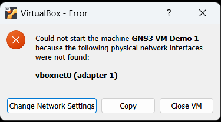
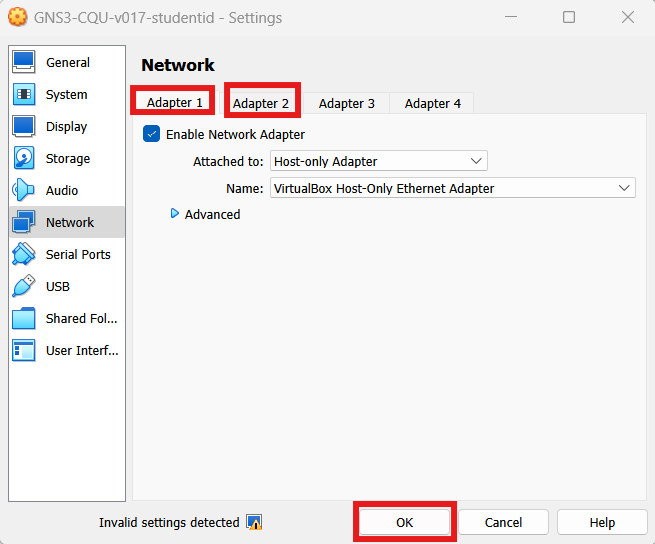

# Troubleshooting

Things that go wrong with the appliance, and what to do about them. Each entry names the error as
you will actually see it, so searching this page for the text on your screen should find it.

**Three layers, and they fail independently.** Most confusion here comes from fixing the wrong one:

| Layer | What it is |
|---|---|
| Your computer | The host running VirtualBox or VMware |
| The GNS3 VM | The appliance itself — one virtual machine |
| A node | A container or Qemu VM *inside* a topology |

A fix applied to one does nothing for the others, and a node keeps its own state once it has
started. When in doubt, work down the list in that order.

**Before anything else, confirm which release you are running.** A renamed `.ova` proves nothing,
and several fixes below depend on the appliance version:

```sh
cat /etc/gns3-cqu-release
```

---

## Importing and starting the appliance

### Import of the appliance (.ova) fails

**Applies to:** PC (VirtualBox) and Mac (VMware)

If importing the `.ova` produces an error, the two common causes are insufficient disk space and a
corrupt download.

Once the `.ova` is on your computer you need at least another 15 GB free. Importing unzips several
large disk images, and depending on the projects included in the GNS3 VM they may need 15 to 20 GB
(or more). If your disk is close to full — less than 20 GB remaining — expect errors, and free up
space before trying again.

You can delete the `.ova` *after* a successful import, though you may want to download it again
later to get back to a clean appliance.

A corrupt `.ova` usually means the download was interrupted. Check with your teacher or colleagues
to confirm the expected file size.

*Verified 22 September 2026.*

### The VM will not start: network adapter errors

**Applies to:** PC (VirtualBox)

Two versions of the same fault. Either the VM refuses to start with a message about network
adapters, or — commonly the first time you import — it reports that a host-only interface such as
`vboxnet0` cannot be found:



The adapter information saved inside the appliance does not match the host-only networks your copy
of VirtualBox actually has. Importing an appliance exported on a different operating system — a
Windows host to a Linux one, say — is a common way to end up here.

**Fix.** Stop the VM, open *Settings → Network*, click the *Adapter 1* tab and then the *Adapter 2*
tab, and press *OK*. Visiting both tabs refreshes the adapter information to match your machine.



You can ignore any 'Invalid settings detected' message. Now start the VM again.

If that does not fix it, check that Adapter 1 is Host-only and Adapter 2 is NAT, and that the
host-only network itself exists — see
[Host-only Networks in VirtualBox](./virtualbox.md#host-only-networks-in-virtualbox).

*Verified 22 September 2026.*

---

## Starting nodes

### `KVM acceleration cannot be used (/dev/kvm doesn't exist)`

**Applies to:** Qemu nodes only — OpenWRT, OPNsense. Docker nodes are unaffected, so most
activities still work.

Your host has no nested virtualisation to pass through to the GNS3 VM. The usual causes are a
managed Windows laptop where Credential Guard or memory integrity keeps Hyper-V holding VT-x, so
VirtualBox cannot pass it on; and VMware Fusion on Apple Silicon, which has none to give.

**Appliances built from August 2026 onwards already carry the fix** — the build's `accel` phase
writes it. Check before changing anything:

```sh
grep -A2 '\[Qemu\]' ~/.config/GNS3/2.2/gns3_server.conf
```

If that shows `require_kvm = false`, this is not your problem and the error means something else.

**Fix.** In the GNS3 server — the hypervisor's terminal window — enter a shell and edit the config:

```sh
nano ~/.config/GNS3/2.2/gns3_server.conf
```

Add these lines at the bottom:

```
[Qemu]
require_kvm = false
```

Save and start the node again. No restart of the GNS3 service is needed; it watches this file and
reloads within about a second.

> **Use `require_kvm`, not `enable_kvm`.** This was documented as `enable_kvm = false` until August
> 2026, which works but is the wrong lever. `require_kvm = false` keeps hardware acceleration
> wherever it exists and only falls back to emulation where it does not; `enable_kvm = false` turns
> acceleration off everywhere, including on machines that have it. OPNsense boots in about 20
> seconds with KVM and takes minutes without, so the difference is worth having. On Linux the older
> `enable_kvm`/`require_kvm` names override the newer
> `enable_hardware_acceleration`/`require_hardware_acceleration` ones, which is why a stray
> `enable_kvm = false` left in this file silently makes everything slow.

*Verified 22 September 2026, appliance v035.*

---

## Inside a node

### `Fatal Python error: init_interp_main: can't initialize time`: a node's date is wrong by years

**Applies to:** Qemu nodes (OPNsense, OpenWRT) most severely; any node in principle

A node reports a date far in the future or the past — a year such as 2319 rather than the current
one. On OPNsense the boot messages give it away before the date line does:

```
Fatal Python error: init_interp_main: can't initialize time
OverflowError: timestamp too large to convert to C _PyTime_t
>>> Error in start script '90-cron'
```

**That error names the problem exactly.** Python counts time in nanoseconds in a 64-bit number,
which runs out on **11 April 2262**. Past that date every Python program on the node fails the
moment it starts — not some of them, all of them. On OPNsense that takes out `configd`, so
`configctl` and much of the web interface stop working, while the shell-based start scripts
(`90-sysctl`, `95-beep`) carry on as though nothing is wrong. Certificates fail as well, because
every one of them now looks long expired.

**The console login still works.** `root` / `opnsense` at the node console is not affected by the
wrong clock, so use it to run the checks below. If that login is refused, you have a second,
unrelated problem — the password is `opnsense`, all lower case, and the `Password:` prompt shows
nothing at all as you type.

**Check all three clocks, in order.** They are independent, and a node almost always inherits a
wrong clock rather than generating one of its own.

1. **Your computer.** Confirm its own clock and time zone are right. Everything below inherits from
   it.

2. **The GNS3 VM.** Start a **Linux Host** node and run `date` at its console. Docker nodes share
   the appliance's clock exactly, so that reading *is* the GNS3 VM's clock — no login needed.

3. **The node.** Run `date` at the OPNsense console.

If the Linux Host is wrong too, the fault is above the node — fix your computer and the GNS3 VM, and
the node will come good on its next start.

**On an appliance older than v044, an OpenWRT Router node can set the GNS3 VM's clock hours wrong.**
When it starts, it copies the virtual machine's hardware clock into the GNS3 VM's clock, and on
some computers that hardware clock holds local time rather than UTC. That puts the VM hours out,
often by exactly your time-zone offset. To fix the GNS3 VM, **shut it down and start it again**
with your computer connected to the internet. It sets its clock from the internet as it starts.
Then stop and start your nodes. The OpenWRT Router in v044 and later no longer touches the clock.

**Fix.** Correct your computer and the GNS3 VM first, then **stop and start the node**. A node takes
its start time from the appliance when it boots and keeps its own clock afterwards, so correcting
the VM does nothing for a node that is already running — it has to be restarted to pick the new time
up.

If the node is still wrong after a restart, set it at the console. OPNsense is FreeBSD, which takes
`CCYYMMDDhhmm.ss`, in UTC. On `OPNsense1`:

```sh
date 202609221830.00
```

**Take that value from your phone or your computer — never read it off a clock you already know is
wrong.** Copying a time out of the broken clock is an easy way to end up further out than you
started.

**Nothing needs rebooting afterwards.** Python starts working the moment the date is right. To bring
back the services that failed at boot, on `OPNsense1`:

```sh
service configd restart
```

**Why.** GNS3 starts a Qemu node with no clock settings at all, so the node reads the **appliance's**
clock once at boot and then keeps its own time — nothing corrects it afterwards. Where the appliance
can offer KVM, the node uses a paravirtualised clock tied to the appliance's; without KVM it falls
back to an emulated timer, which on a tested appliance still kept time to within four seconds a day.
So a node centuries out did not drift there on its own: it started from a clock that was already
wrong. That is why your computer and the GNS3 VM are the first two things to check, not the node.

*Verified 22 September 2026 on an OPNsense 24.1 node, with the fault reproduced deliberately: the
Python failure, the dead `configd` and the recovery were all observed. The claim that a node's own
emulated timer runs away was tested and did not hold. The OpenWRT Router cause was found on
25 September 2026 on an Apple Silicon appliance, from the VM's own logs, and a restart was seen to
correct the clock. The time-zone-offset explanation on Windows PCs is not yet verified.*

---

## Four checks to report a problem

If your tutor asks what your appliance is doing, these four answer most of it. They only read —
they change nothing.

**Get a shell on the GNS3 VM.** Open the VM's console window in VirtualBox or VMware and choose
**Shell** from its menu. Type each command and photograph or copy out what it prints.

```sh
date -u
```

```sh
ls /dev/kvm
```

```sh
curl -s localhost/v2/version
```

```sh
grep -h adapter_type /opt/gns3/projects/*/*.gns3 | sort -u
```

**What the answers mean.**

| Command | Healthy answer | What else means |
|---|---|---|
| `date -u` | the real time, in UTC | a wrong clock here is inherited by every node started afterwards — see the clock entry above |
| `ls /dev/kvm` | `/dev/kvm` | `No such file` means Qemu nodes run emulated: slow to boot, but not by itself a clock fault |
| `curl …/v2/version` | a GNS3 version | no answer at all means this is not the CQU appliance — a stock GNS3 VM answers on port 3080, not port 80 |
| `grep … adapter_type` | `virtio-net-pci` for OPNsense | `e1000` means the node was not built from the CQU template, so OPNsense calls its cards `em0`–`em3` instead of `vtnet0`–`vtnet3` and these instructions will not match your screen |

The last command lists every Qemu node you have saved, so on a VM with several projects expect
several lines. `e1000` is correct for the **FRR** and **NETem** routers — it is only wrong for
OPNsense.

Adapter type is stored in the **project**, not the template, so a project built on another machine
keeps its own setting even on a correct appliance. To change it, stop the node, then right-click it
→ Configure → Network → Type.

## Still stuck

- The guide for your hypervisor — [VirtualBox](./virtualbox.md) or [VMware](./vmware.md) — covers
  settings and networking.
- [Using the GNS3 web interface](./using-gns3.md) covers topologies, consoles and importing a
  project.
- [Saving your work](./gns3-saving-work.md) explains why configuration on a node disappears when a
  project is closed. That is expected behaviour, not a fault.

At CQU, ask on your unit's discussion forum, and say which release
(`cat /etc/gns3-cqu-release`) and which hypervisor you are running.
