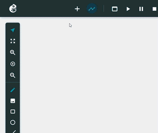
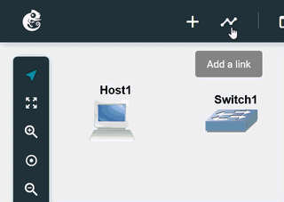
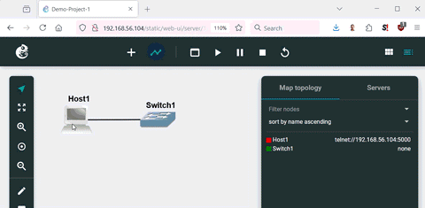
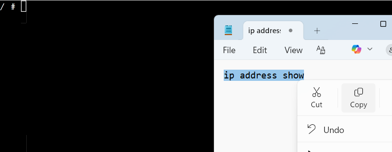
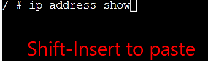
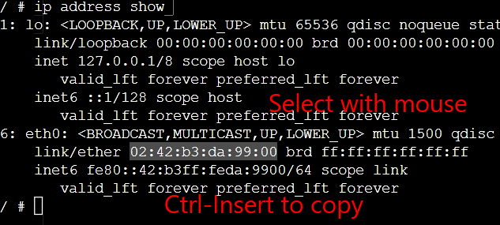
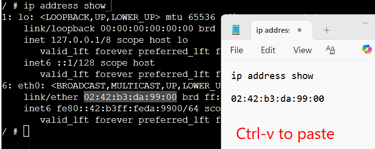

# Using GNS3 Web User Interface

We are using the web user interface (UI) for GNS3. That is, the GNS3 server runs as a virtual machine on the host computer (Windows or Mac), while a web browser on the host is used to access that GNS3 server. (You can install a separate UI for Windows, but we are not using that here - we only use the web UI).

Here are some tips and tricks with using the GNS3 web UI. There is no attempt to cover all aspects of the UI; just a few tasks to get started and some features that may be useful for new users.

# GNS3 Web Interface Basics

## Adding a Node

Click on plus (+), select the node type and *drag* it to the project workspace. 

## Adding Links

Click on the link icon, then click on first node and select interface. Then click on second node and select interface.

## Node Context Menu

Right-click on a node to display the node context menu.

## Starting a Nodes

Right-click on a node to display the context menu, then select start. Once the node is shown as green in the node list (Mpa topology), right-click again and *Web console in new tab*.

## Web Console or Web Console in New Tab

You can either use the *Web console*, which starts a small window on the GNS3 project workspace, or use *Web console in new tab*, which opens the console in a new browser tab. Choose whichever approach you prefer.

Do not use *Console* or *Auxillary console* as most of our nodes do not support that. In most instructions, if we refer to a *console* or *terminal*, then we normally mean a *web console* in GNS3.

## Copy and Paste in Web Console: Ctrl/Shift-Insert

The web console does not support the traditional Ctrl-C and Ctrl-V copy and paste. This is because those keyboard combinations have special meanings in some console. However most browsers while support the special commands of:

- Copy with Ctrl-Insert
- Paste with Shift-Insert

You can still use the normal copy-and-paste keyboard combinations in other programs. 

For example, to copy from Notepad to the web console, use the normal Notepad copy, such as right-click and Copy or Ctrl-c:

Now in the web console, use Shift-Insert to paste:

You can copy from the web console by selecting text with your mouse and then Ctrl-Insert:

And then paste that into Notepad using the normal approach, such as right-click and Paste or Ctrl-v.

