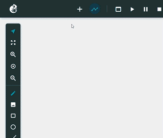
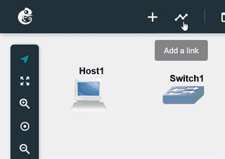
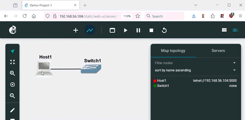
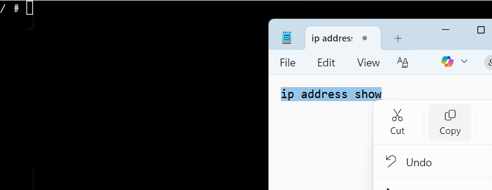
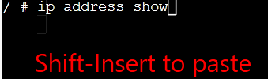
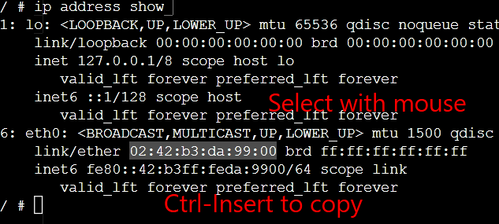
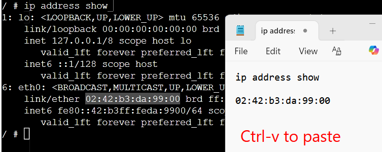

# Using GNS3 Web User Interface

We are using the web user interface (UI) for GNS3. That is, the GNS3 server runs as a virtual machine on the host computer (Windows or Mac), while a web browser on the host is used to access that GNS3 server. (You can install a separate UI for Windows, but we are not using that here - we only use the web UI).

Here are some tips and tricks with using the GNS3 web UI. There is no attempt to cover all aspects of the UI; just a few tasks to get started and some features that may be useful for new users.

# Importing a Project

The GNS3 virtual machine comes with a small number of demonstration projects already loaded. Most of the projects you need for your unit are not on the virtual machine – you download them from Moodle and import them yourself. A project is a single file ending in `.gns3project`.

You only import a project once. After that it stays on your virtual machine and appears in the project list every time you open GNS3.

1. Download the `.gns3project` file from Moodle to your host computer. Note where your browser saved it.
2. Open GNS3 in your browser and go to the project list. If a project is already open, close it first.
3. Select *Import project*, choose the file you downloaded, and give the project a name if you are asked for one.
4. Wait for the upload to finish. Large projects take a while – one of them is several hundred megabytes, so do not close the browser tab while it is working.
5. Open the imported project from the list and start the nodes as normal.

If the import fails, the two common causes are that the file did not download completely, and that the virtual machine has run out of disk space. A project expands to several times the size of the file you downloaded.

Importing a project does not install anything else. All of the node images the activities use are already on the virtual machine, so an imported project is ready to start.

# GNS3 Web Interface Basics

## Adding a Node

Click on plus (+), select the node type and *drag* it to the project workspace. 

## Adding Links

Click on the link icon, then click on first node and select interface. Then click on second node and select interface.

## Node Context Menu

Right-click on a node to display the node context menu.

## Starting a Node

Right-click on a node to display the context menu, then select start. Once the node is shown as green in the node list (Mpa topology), right-click again and *Web console in new tab*.

## Web Console or Web Console in New Tab

You can either use the *Web console*, which starts a small window on the GNS3 project workspace, or use *Web console in new tab*, which opens the console in a new browser tab. Choose whichever approach you prefer.

Do not use *Console* or *Auxillary console* as most of our nodes do not support that. In most instructions, if we refer to a *console* or *terminal*, then we normally mean a *web console* in GNS3.

## Copy and Paste in Web Console: Ctrl/Shift-Insert

The web console does not support the traditional Ctrl-C and Ctrl-V copy and paste. This is because those keyboard combinations have special meanings in some console. However most browsers while support the special commands of:

- Copy with Ctrl-Insert
- Paste with Shift-Insert

You can still use the normal copy-and-paste keyboard combinations in other programs. 

For example, to copy from Notepad to the web console, use the normal Notepad copy, such as right-click and Copy or Ctrl-c:

Now in the web console, use Shift-Insert to paste:

You can copy from the web console by selecting text with your mouse and then Ctrl-Insert:

And then paste that into Notepad using the normal approach, such as right-click and Paste or Ctrl-v.

