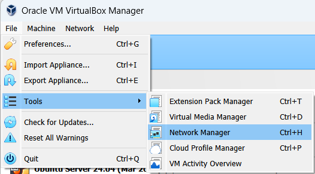
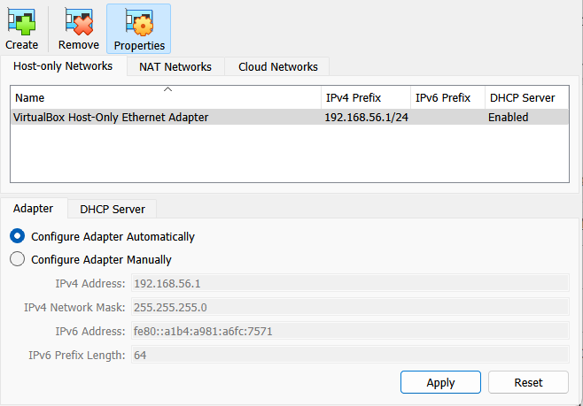
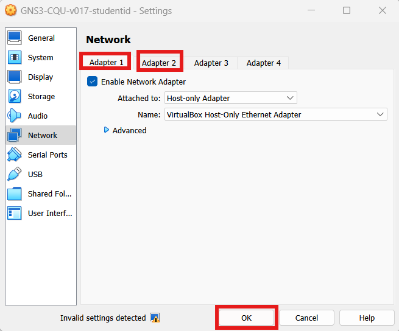

# VirtualBox for GNS3

Hints and issues with using Oracle VirtualBox for GNS3 VM. You should only need this if you have problems. To get started with GNS3, see instructions for [PC](./getting-started-pc.md) or [Mac](./getting-started-mac.md).

# Installing VirtualBox

## VirtualBox in CQUniversity

Most CQU computer labs have VirtualBox already installed. You can go direct to the [Getting Started](./getting-started-pc.md) instructions.

CQU staff can install VirtualBox on their CQU laptops via the Company Portal. 

Please note there may be restrictions on accessing the VirtualBox (and other Oracle) website while inside the CQU network. This does not prevent you from running VirtualBox, but may stop you from viewing VirtualBox documentation or downloading for your personal computer. In that case you will need to use your own Internet connection (i.e., mobile phone or home internet).

## Installing VirtualBox on Personal Device

VirtualBox is free software available via [www.virtualbox.org/](https://www.virtualbox.org/). You can download and install for your personal device (e.g., personal laptop). 

For Windows laptops, downloading and installed the latest VirtualBox version is recommended. You do *not* need the extension pack to run GNS3. You will need administrator rights to install on your own computer.

For Apple laptops with Apple Silicon (M1, M2, ... chips, mainly since 2020), a different setup of GNS3 VM is required. See [Getting Started on an Apple Mac](./getting-started-mac.md). For older Apple devices (with Intel chips), you could try installing VirtualBox for *macOS / Intel hosts* and then following the [Getting Started on a PC](./getting-started-pc.md) instructions.

For computers running Linux natively, install VirtualBox and then follow the [Getting Started on a PC](./getting-started-pc.md) instructions.

# Setting Up VirtualBox

Assume you have VirtualBox installed, then the only setup that may be needed is to allow *Host-only Networks*. 

## Host-only Networks in VirtualBox

From the *File* menu select *Tools* then *Network Manager*:

In the *Host-only Networks* tab you require an entry such as:
- VirtualBox Host-only Ethernet Adapter
- 192.168.56.1/24
- DHCP Server Enabled

Example settings are:

If there is no Host-only Network, then click *Create* and add one with the above settings. You may need administrator rights on your computer do make those changes.

# Troubleshooting GNS3 and VirtualBox

## Import of Appliance (.ova) Fails

If you attempt to import the .ova file into VirtualBox but it produces an error, the most common causes are:
- Insufficient disk space on your computer
- Corrupt .ova file downloaded

Once you have downloaded the .ova file to your computer, you need at least an additional 15 GB of free space on your computer. Importing the .ova actually unzips multiple large disk images, and depending on the number of projects included in GNS3 VM, they may require 15 to 20 GB of free disk space (or even more).

If your disk is close to full (less than 20 GB of space remaining), then you may encounter errors when importing the appliance. You will need to free up some space on your disk. 

Note that you can delete the .ova file *after* the import is successful. But you may need to download the .ova again later if you want to revert back to a clean GNS3 VM.

A corrupt .ova may occur if the download was interrupted. Check with your teacher or colleagues to confirm the expected size of the .ova.

## Error Starting VM: network adpaters

If you receive an error when trying to start the GNS3 VM that mentions network adapters, then a common cause is Host-only Networks not setup correct, including using a different name on yuor computer compared to the original GNS3 VM.

One quick fix is to stop the VM, go to Settings and Network, and then click on both Adapter 1 tab and Adapter 2 tab and the click Ok.

If the error is not fixed, then double-check the settings on Adapter 1 (should be Host-only) and Adapter 2 (should be NAT). Also check that Host-only Networks are setup (see above).

