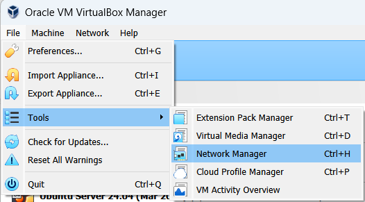
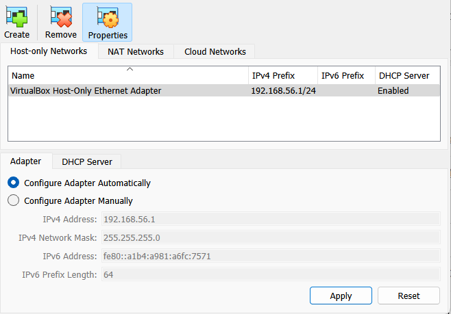

# VirtualBox for GNS3

Hints and issues with using Oracle VirtualBox for GNS3 VM. You should only need this if you have problems. To get started with GNS3, see instructions for [PC](./getting-started-pc.md) or [Mac](./getting-started-mac.md).

## Installing VirtualBox

### On a managed or lab computer

A computer lab often has VirtualBox installed already — if yours does, go straight to the
[Getting Started](./getting-started-pc.md) instructions. On a managed work laptop you may need
your IT department's software portal rather than a download.

**At CQU:** most computer labs have VirtualBox installed, and staff can install it on a CQU
laptop through the Company Portal. The CQU network may block the VirtualBox (and other Oracle)
website — that does not stop VirtualBox running, but it can stop you reading the documentation
or downloading it for a personal machine, for which you will need your own internet connection.

### Installing VirtualBox on Personal Device

VirtualBox is free software available via [www.virtualbox.org/](https://www.virtualbox.org/). You can download and install for your personal device (e.g., personal laptop). 

For Windows laptops, downloading and installed the latest VirtualBox version is recommended. You do *not* need the extension pack to run GNS3. You will need administrator rights to install on your own computer.

For Apple laptops with Apple Silicon (M1, M2, ... chips, mainly since 2020), a different setup of GNS3 VM is required. See [Getting Started on an Apple Mac](./getting-started-mac.md). For older Apple devices (with Intel chips), you could try installing VirtualBox for *macOS / Intel hosts* and then following the [Getting Started on a PC](./getting-started-pc.md) instructions.

For computers running Linux natively, install VirtualBox and then follow the [Getting Started on a PC](./getting-started-pc.md) instructions.

## Setting Up VirtualBox

Assume you have VirtualBox installed, then the only setup that may be needed is to allow *Host-only Networks*. 

### Host-only Networks in VirtualBox

From the *File* menu select *Tools* then *Network Manager*:

In the *Host-only Networks* tab you require an entry such as:
- VirtualBox Host-only Ethernet Adapter
- 192.168.56.1/24
- DHCP Server Enabled

Example settings are:

If there is no Host-only Network, then click *Create* and add one with the above settings. You may need administrator rights on your computer do make those changes.

## Troubleshooting

Import failures and network adapter errors — along with the rest of the appliance's common
problems — are collected in [Troubleshooting](./troubleshooting.md).
