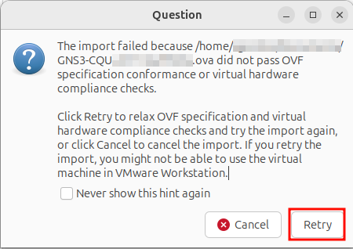
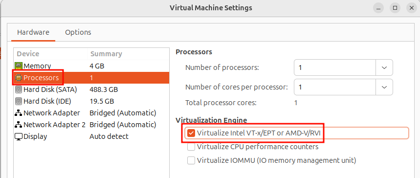
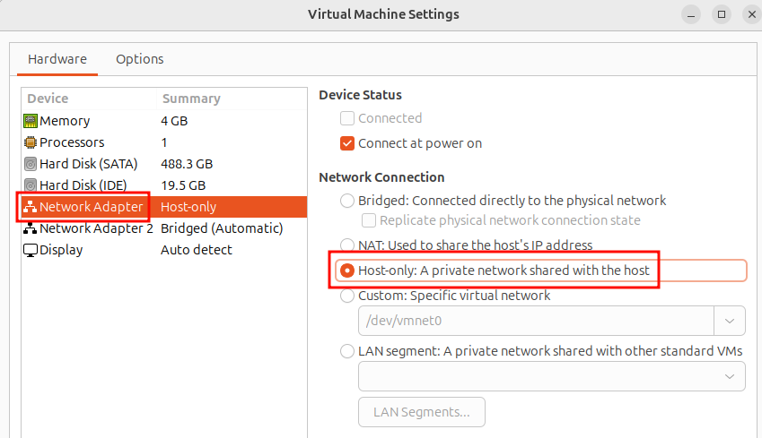
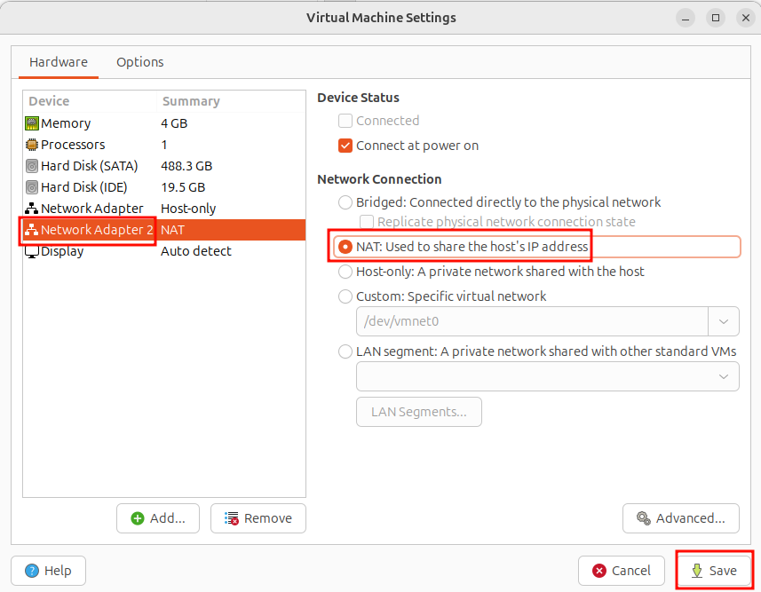
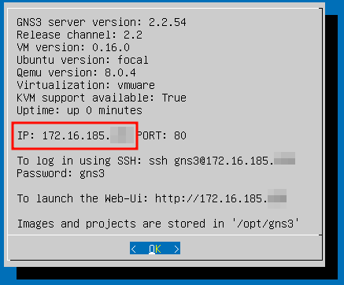

# VMware for GNS3

As VirtualBox is available in CQUniversity lab computers, you are recommended to use VirtualBox. Most instructions are assuming VirtualBox.

However if you want to use VMware on your personal laptop (instead of VirtualBox), then it should be possible. 

# Installing VMWare

## Installing VMWare Workstation on Windows or Linux

VMWare Workstation (for Intel chips, e.g., Windows, Linux) is free. However you do need a Broadcom Support account to download the software. 

Go to [https://support.broadcom.com/web/ecx](https://support.broadcom.com/web/ecx) and Register for a new Broadcom Support account. Once you have an account, login and visit *My Downloads* then search for VMWare. Find *VMWare Workstation Pro* for Windows (or Linux if you are running Linux natively). Follow the steps to download the installer. You may be required to supply your address and agree to various terms and conditions. You are responsible for abiding by them.

Once the installer is downloaded, run it to install VMWare. You will need administrator privileges.

## Installing VMWare Fusion on Apple Mac

VMWare Fusion is for Apple Mac computers with M1, M2, ... chips (i.e., Apple Silicon). Follow the same approach as installed VMWare Workstation on Windows, but look for VMWare Fusion.

# Using VMWare with GNS3

The existing .ova files provided for import into VirtualBox can also be imported into VMWare. However there are several changes you may need to make.

From the *File* menu select *Open* and choose the .ova file (see [Getting Started with GNS3](./getting-started-pc.md) for the location of the .ova file). 

You will likely be presented with a *Question* saying the import failed due to OVF conformance. Don't worry, just select *Retry* to relax the checks:

The .ova should now import. Once imported there are some settings that should be changed (via the *Settings* menu for the VM):
- Processors, Virtualize Intel VT-x/EPT or AMD-V/RVI can be enabled (if possible)
- Network Adapter, Host-only
- Network Adapter 2, NAT

Save the settings and start the VM.

Once the GNS3 VM starts you have the same enivornment as using VirtualBox. That is, you now use a web browser to visit the IP address shown in the GNS3 information screen.

Note however the IP addresses used by VMware host-only adatper (172.16.185.xx) are different than used by VirtualBox host-only adapter (192.168.56.xx). This normally will not cause any problems, as the nodes in GNS3 projects have their own IP address range. Just be aware that many activity instructions and demos use the VirtualBox host-only IP address range.

