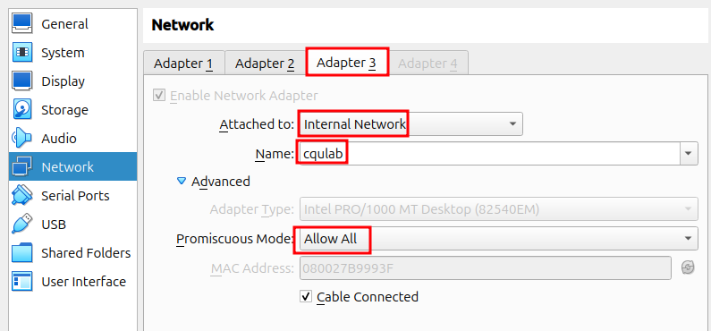
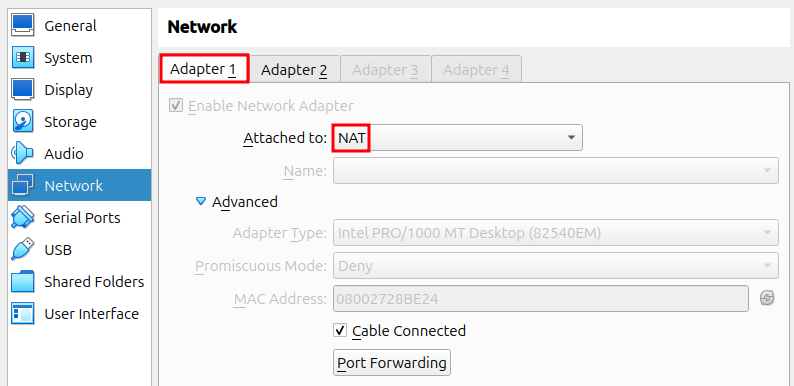
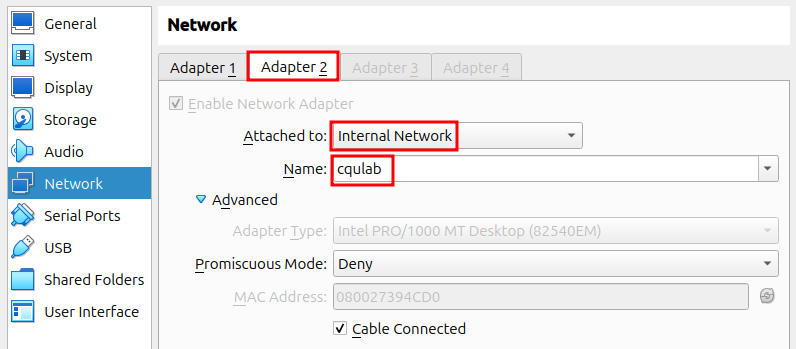
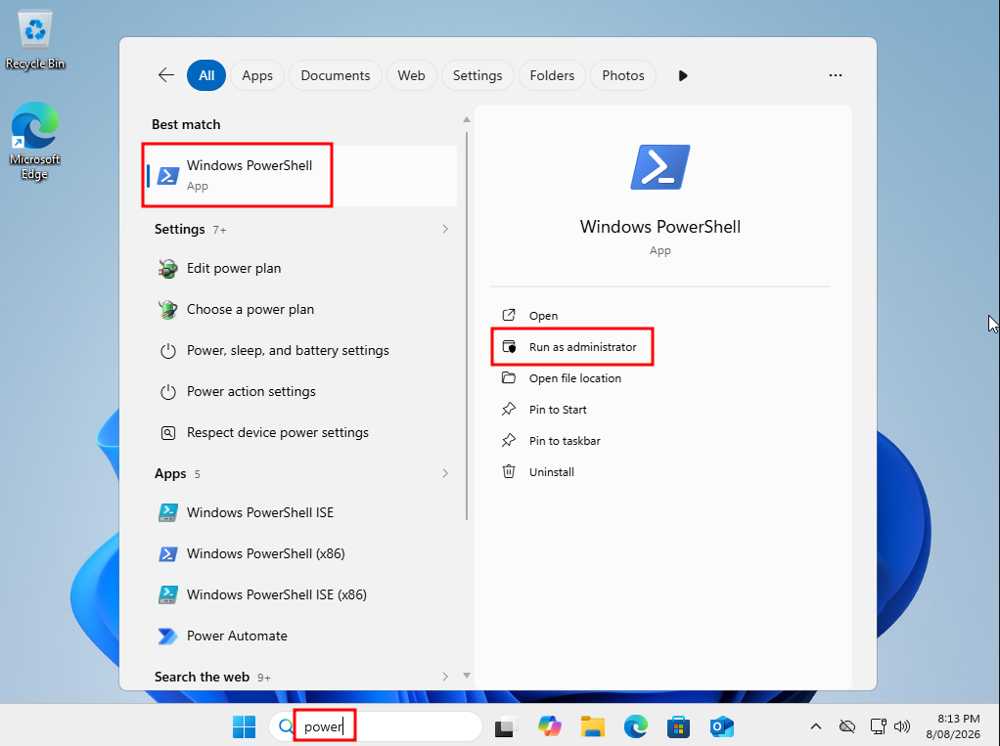
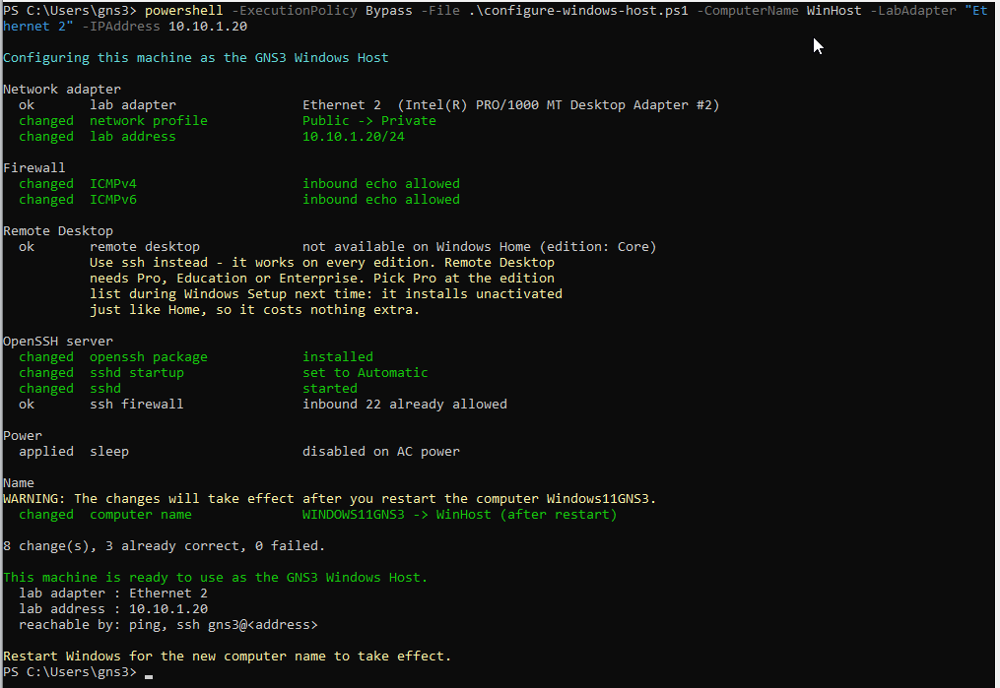
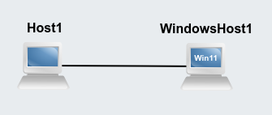
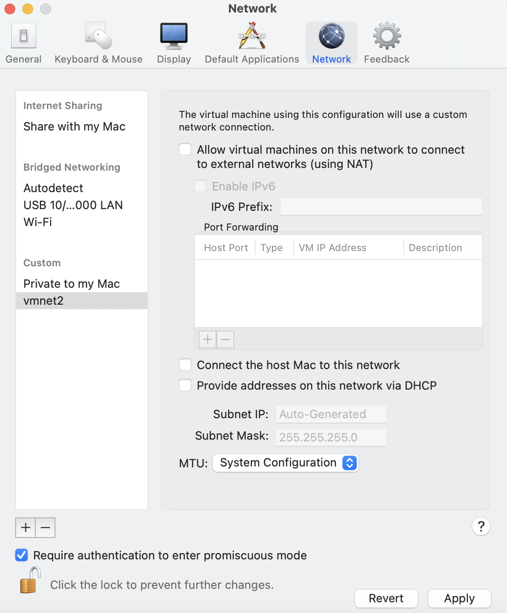
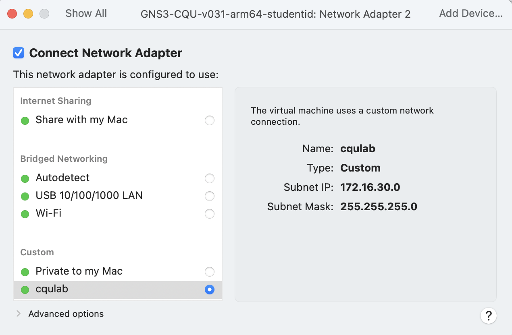
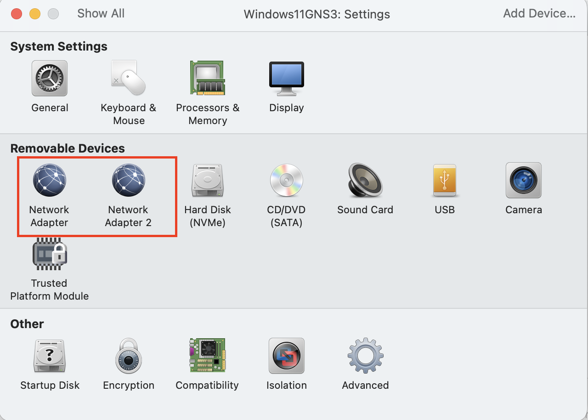
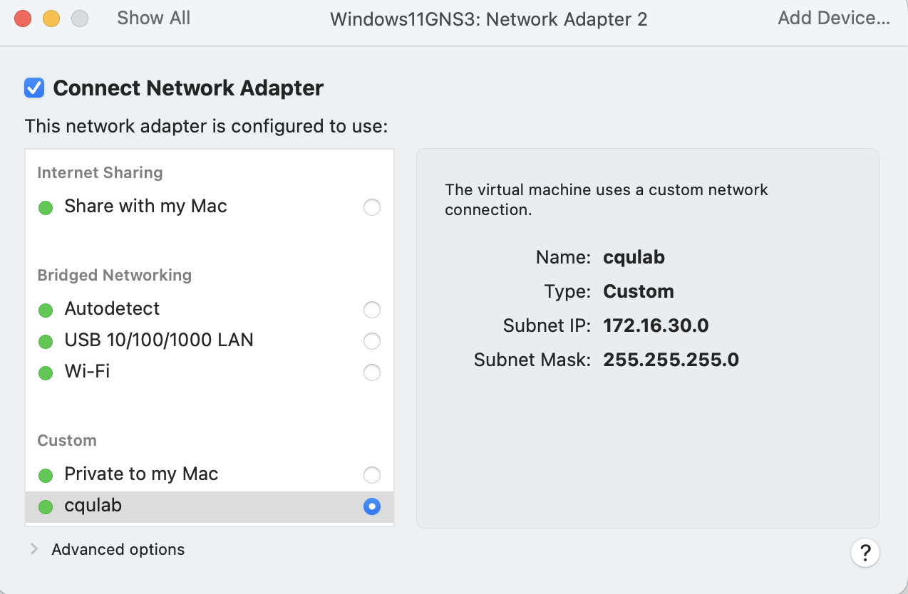

# Guide: Adding a Windows Host to GNS3

This guide explains how to add a Windows machine to your GNS3 network, so that a Windows computer
can send and receive traffic with the Linux nodes in your project. You can then ping it, log in to
it over SSH, capture its traffic, and see how Windows behaves on a network you built yourself.

The Windows machine does **not** run inside GNS3. It runs beside GNS3, as a second virtual machine
in VirtualBox, and the two are joined by a private network. GNS3 shows it on your canvas as a node
called *Windows Host*, and from inside your project it behaves like any other host.

This is a practical guide only. It does not tell you what network to build or what to submit – that
comes from your own unit's activity instructions.

> **Apple Mac computers.** These steps are for a PC running VirtualBox. The same setup works on an
> Apple Mac, including Apple Silicon, using VMWare Fusion – but the menus and network names are
> different. If you use a Mac, read *Apple Mac: Using VMWare Fusion* at the end of this guide before
> you start. It replaces Steps 2 and 3, and adds two things to Step 4.

## What You Need

- **GNS3 already running**, following your unit's getting started instructions.
- **16 GB of RAM.** You will be running the GNS3 VM and a Windows virtual machine at the same time.
  With 8 GB it will be very slow, and may not run at all.
- **About 30 GB of free disk space** for the Windows virtual machine.
- **A Windows 11 installation file**, called an ISO. This is a free download from Microsoft – see
  Step 1.
- **About an hour**, most of which is Windows installing itself while you do something else.

You do not need a product key. Windows runs without one, and everything in this guide works on an
unactivated copy. See *About the Windows licence* at the end.

## How It Works

Three pieces have to line up.

- **A private network inside VirtualBox.** This is a network that only your virtual machines can
  see. It is not connected to the internet, to CQUniversity, or to anything else on your computer.
- **A third network adapter on the GNS3 VM**, connected to that private network. Inside the GNS3 VM
  this adapter is called `eth2`. *(On a Mac there is no third adapter and the lab network is `eth1`
  — see the Apple Mac section.)*
- **A *Windows Host* node in your GNS3 project**, which is joined to `eth2`. Anything you connect
  this node to in GNS3 can reach the Windows machine, and the other way around.

So traffic leaves a node in your project, crosses the *Windows Host* node onto `eth2`, travels over
the private VirtualBox network, and arrives at the Windows machine. It is a real network path, not a
simulation of one.

## Step 1: Download Windows

Go to the Microsoft download page for Windows 11 at
https://www.microsoft.com/software-download/windows11 and download the disk image, which is a `.iso`
file of about 6 GB. Choose the 64-bit version for a PC.

Start this download first and carry on with Step 2 while it runs.

## Step 2: Add a Third Adapter to the GNS3 VM

The GNS3 VM must be **shut down** for this. Closing the GNS3 window in your browser is not enough –
shut the virtual machine down properly from the VirtualBox window.

1. In VirtualBox, select the GNS3 VM and click *Settings*, then *Network*.
2. Go to the *Adapter 3* tab and tick *Enable Network Adapter*.
3. Set *Attached to* to **Internal Network**.
4. Set *Name* to `cqulab`. Type it carefully and remember exactly what you typed – VirtualBox
   creates a brand new, separate network for any name it has not seen before, and a typing mistake
   looks exactly like success until nothing works.
5. Open *Advanced* and set *Promiscuous Mode* to **Allow All**. Without this the Windows machine and
   your GNS3 nodes cannot exchange traffic.
6. Click *OK*, then start the GNS3 VM again.



Leave Adapters 1 and 2 exactly as they are. They are how you reach GNS3 in your browser and how the
GNS3 VM reaches the internet, and changing them will stop GNS3 working.

## Step 3: Create the Windows Virtual Machine

In VirtualBox, click *New* and create a virtual machine:

- **Name:** `WindowsHost`
- **Type:** Microsoft Windows, **Version:** Windows 11 (64-bit)
- **ISO Image:** the file you downloaded in Step 1
- **Memory:** 4096 MB, **Processors:** 2
- **Disk:** 64 GB

If VirtualBox offers *Skip Unattended Installation*, tick it. You will install Windows yourself in
the next step.

Before starting the machine, open its *Settings* and give it **two** network adapters:

- **Adapter 1:** *Attached to* **NAT**. This is how Windows reaches the internet.

  

- **Adapter 2:** *Attached to* **Internal Network**, *Name* `cqulab` – the same name you used in
  Step 2. This is the lab network.

  

Leave *Promiscuous Mode* on **Deny** here. Only the GNS3 VM needs it set to *Allow All*, because
only the GNS3 VM has to carry traffic on behalf of the nodes inside your project. Windows just
receives its own.

Two adapters is the part people get wrong. A machine with only the NAT adapter can browse the web
perfectly well and still be completely invisible to your GNS3 nodes.

## Step 4: Install Windows

Start the virtual machine and follow the Windows installer.

- When asked for a product key, choose *I don't have a product key*.
- If you are offered a choice of edition, choose **Windows 11 Pro**. Every edition installs the same
  way without a key, and Pro can be reached by Remote Desktop where Windows Home cannot.
- Create a local account. This guide assumes the username `gns3` with the password `gns3`. If you
  choose something else, use your own username wherever this guide says `gns3`.

Windows takes 30 to 60 minutes to install and restarts itself several times.

## Step 5: Set Up Windows for the Lab

A freshly installed Windows will not answer a ping and will not let anything log in to it. One
script fixes all of that. Inside the Windows machine, click *Start*, type `powershell`, then
right-click *Windows PowerShell* and choose **Run as administrator**.



Then type these two commands. The first downloads the script, the second runs it.

```
cd $HOME

Invoke-WebRequest -Uri "https://raw.githubusercontent.com/steve-cqu/gns3/refs/heads/main/server/windows/configure-windows-host.ps1" -OutFile .\configure-windows-host.ps1

powershell -ExecutionPolicy Bypass -File .\configure-windows-host.ps1 -LabAdapter "Ethernet 2" -IPAddress 10.10.1.20 -ComputerName WinHost
```

That gives the Windows machine the address `10.10.1.20` on the lab network. Use a different address
if your unit's instructions say so, and keep it in the same range as the rest of your project.



The script prints one line per setting as it goes, then a summary. It:

- allows other machines to ping this one, which Windows blocks by default
- installs and starts an SSH server, so you can log in from a GNS3 node
- switches the lab adapter from a public to a private network, so Windows stops blocking traffic
- sets the lab address you asked for, and renames the machine
- stops the machine going to sleep in the middle of a lab

If `Invoke-WebRequest` fails the first time with a message about a name that could not be resolved,
wait a few seconds and run it again. The network inside a freshly installed Windows takes a little
while to settle.

## Step 6: Install the Lab Tools

**Only if your unit's activity needs them.** Everything up to here makes the machine reachable,
which is all some activities require. This step downloads about 200 MB, so skip it unless you have
been told to.

In the same Administrator PowerShell:

```
Invoke-WebRequest -Uri "https://raw.githubusercontent.com/steve-cqu/gns3/refs/heads/main/server/windows/setup-windows-tools.ps1" -OutFile .\setup-windows-tools.ps1

powershell -ExecutionPolicy Bypass -File .\setup-windows-tools.ps1 -All
```

That installs:

- **Sysinternals** – about 160 tools in `C:\Tools\Sysinternals`, including *TCPView*, which shows
  every network connection and which program owns it
- **IIS** – a web server, so other nodes can fetch a page from this machine on port 80
- **Python 3**
- **iperf3** – for measuring throughput to and from the Linux nodes
- **The telnet client** – for checking whether a port answers

To see what is already installed without changing anything, use `-List`. To see what a run would
change, add `-DryRun`. Running it twice is harmless.

## Step 7: Restart Windows

Restart now, before going on. Two things need it:

- the new computer name from Step 5
- the web server and telnet client from Step 6, which report themselves as installed but whose
  programs and services do not exist until Windows has restarted

## Step 8: Add the Windows Host to Your Project

Open your project in GNS3, and from the node list on the left drag in:

- a **Windows Host** – it appears under *End devices*, with a monitor icon labelled Win11
- a **Linux Host**, if your project does not already have one

Connect them, either directly or through the rest of your topology, and start the project.



Give the Linux Host an address in the same range as the Windows machine. On the Linux Host console:

```
ip address add 10.10.1.10/24 dev eth0
ip link set eth0 up
```

The *Windows Host* node needs no configuration. It has a single port, which is already joined to the
lab network.

> **On a Mac the node uses `eth1`, not `eth2`.** A *Windows Host* node you drag from the GNS3
> templates is already correct — on a Mac appliance the template binds `eth1`. What is not
> automatic is a project someone **exported on a PC**: it carries `eth2` inside the file, which is
> why the demo project comes in two versions.
>
> The *Windows Host* node is a Cloud node bound
> to the GNS3 VM's lab adapter, and that adapter is `eth2` on a PC but `eth1` on a Mac – see Mac
> Step B. If your project shows **`eth2 not found`** when it starts, this is why. Right-click the
> node, choose *Configure*, and select **`eth1`** on the *Ethernet interfaces* tab.
>
> **The demo project is a download, and there are two of them — take the one for your machine.**
> `Windows-Host-Demo-arm64.gns3project` is the Apple Silicon version, with the *Windows Host* node
> already on `eth1`. `Windows-Host-Demo.gns3project` is the PC version and uses `eth2`, so on a Mac
> it starts with **`eth2 not found`**. Both open as a project called *Windows-Host-Demo*, so check
> the file name you import, not the project name. If you took the wrong one, you do not need to
> start again — right-click the node and change the interface as above.

## Step 9: Check It Works

From the Linux Host console:

```
ping -c 3 10.10.1.20
```

Three replies means the whole path is working. Notice `ttl=128` in the replies – Linux hosts answer
with `ttl=64`, so the number alone tells you a Windows machine replied.

Now log in to Windows from the same console:

```
ssh gns3@10.10.1.20
```

Enter the password, and you have a Windows command prompt inside a GNS3 node. Try `ipconfig`,
`route print` or `arp -a`. Type `exit` to return to the Linux Host.

Finally, from Windows, ping back the other way. Open Command Prompt in the Windows machine and run
`ping 10.10.1.10`.

## If It Does Not Work

Work down this list in order. The first item is by far the most common.

**Nothing can ping the Windows machine.**

1. **Check the Windows machine really has two adapters.** In Windows, open Command Prompt and run
   `ipconfig`. You should see two, one with an address like `10.0.2.15` – that is the internet
   adapter – and one with the lab address you set, such as `10.10.1.20`. If you only see one, go
   back to Step 3 and add the second adapter.
2. **Check both machines use the same network name.** In VirtualBox, look at the GNS3 VM's Adapter 3
   and the Windows machine's Adapter 2. Both must say *Internal Network* with exactly the same name.
   A different name is a different network.
3. **Check Promiscuous Mode is set to Allow All** on the GNS3 VM's Adapter 3, as in Step 2.
4. **Check you ran the script**, and that it did not report anything in red.

**Ping works but SSH stopped after a restart.** Run the script again. Windows treats the lab
network as unidentified and puts it back in the *Public* profile every time it starts, and the
firewall rule that Windows installs with its SSH server only applies to private networks. The
script fixes this by adding its own rule that applies to every profile, so once you have run the
current version it will not happen again.

**The Windows Host node will not start.** Only one project at a time can use the lab network. Close
any other project that contains a *Windows Host* node, then start this one.

**Windows has an address starting with 169.254.** That is the address Windows invents when nothing
has given it a real one. Run the script again from Step 5, making sure you include the `-IPAddress`
option.

**Windows can reach some nodes but not others.** Windows can reach machines in its own address range
directly, but sends everything else to the internet adapter, where it disappears. If your project
has more than one subnet, run the script again with the address of the router that connects them,
for example `-LabGateway 10.10.1.1`.

## Apple Mac: Using VMWare Fusion

Everything in this guide works on an Apple Mac, including Apple Silicon, using VMWare Fusion instead
of VirtualBox. The idea is identical – a private network joining the GNS3 VM and a Windows machine –
but Fusion uses different words for the same things, and there are several extra jobs a PC does not
have.

**Read this section in place of Steps 2, 3 and 5.** Steps 6, 7 and 9 are the same. Step 4 has three
additions noted below, and Step 8 has one difference.

**The Mac is more hands-on than the PC, and deliberately so.** On a PC one command builds the machine
and Windows installs itself unattended. On a Mac, Windows 11's installer ignores the disc that would
answer its questions, so you click through Setup yourself, and two jobs – adding a TPM and installing
VMWare Tools – can only be done from Fusion's menus. Expect to sit with it. Everything below is
written in the order it happens, and every one of these steps exists because skipping it fails in a
way that points somewhere else entirely.

| What differs on a Mac | Where |
|---|---|
| The GNS3 VM has **two** adapters, and the lab network is **`eth1`** not `eth2` | Mac Step B |
| The Windows machine needs a **TPM added by hand** before first boot | Mac Step D |
| You answer Windows Setup yourself, and choose **Windows 11 Pro** | Mac Additions to Step 4 |
| **VMWare Tools** is required or Windows has no network at all | Mac Additions to Step 4 |
| The lab script is run **from the disc**, not downloaded | Mac Step E |
| The *Windows Host* node binds to **`eth1`** | Step 8 |

### What Fusion Calls Things

| VirtualBox | VMWare Fusion |
|---|---|
| Host-only adapter | *Private to my Mac* |
| NAT | *Share with my Mac* |
| Internal Network named `cqulab` | A custom network you create and rename `cqulab` |
| *Promiscuous Mode: Allow All* | *Require authentication to enter promiscuous mode* – see below |

You will find all of these in one place: the *VMWare Fusion* menu, then *Settings*, then *Network*.

### Mac Step A: Create the Private Lab Network

From the *VMWare Fusion* menu choose *Settings*, then *Network*. Click the padlock at the bottom and
enter your Mac password, or nothing on this screen can be changed.

Click **+** to add a network. With the new network selected, leave all three boxes **unticked**:

- *Allow virtual machines on this network to connect to external networks (using NAT)*
- *Connect the host Mac to this network*
- *Provide addresses on this network via DHCP*

Then double-click the new network's name in the list and rename it `cqulab`.



Fusion gives a new network a default name such as `vmnet2` or `vmnet3`, as above. The number it
chooses does not matter and will not necessarily be the same as anyone else's – renaming it `cqulab`
is what makes it easy to pick later.

All three unticked is the whole point. Your GNS3 project decides its own addresses, and nothing on
your Mac joins in or hands out addresses of its own.

Leave *Require authentication to enter promiscuous mode* ticked. This is Fusion's version of
VirtualBox's *Allow All*. The first time you start a project containing a *Windows Host* node, macOS
asks for your Mac password – that is expected, and the project starts as soon as you type it.

Click *Apply*.

### Mac Step B: Point the GNS3 VM's Second Adapter at `cqulab`

Shut the GNS3 VM down properly first. Closing the GNS3 window in your browser is not enough.

**On a Mac the GNS3 VM keeps the two adapters it already has – you do not add a third.** Select it,
choose *Settings*, then *Network*, and set them like this:

| Adapter | Set it to | What it is for | Inside the GNS3 VM |
|---|---|---|---|
| Network Adapter | *Share with my Mac* | The internet, and how your browser reaches GNS3 | `eth0` |
| Network Adapter 2 | **`cqulab`** | The lab network | **`eth1`** |



**This is the one place the Mac differs from the PC for the rest of the guide.** A PC's GNS3 VM has
three adapters and its lab network is `eth2`; yours has two and the lab network is **`eth1`**. Every
later step that mentions `eth2` means `eth1` on a Mac, and Step 8 says so again where it matters.

Two adapters rather than three is deliberate. Fusion does not always give an adapter the position you
expect – one added later through *Add Device* can take a slot that makes it appear **before** the
ones already there, silently swapping the lab and internet networks. With only two adapters, both
present from the start, the order is predictable: the first is `eth0` and the second is `eth1`.

### Mac Step C: Check the Lab Adapter Really Is `eth1`

This step has no PC equivalent and it takes two minutes. If the lab network has landed on the wrong
interface, nothing will ever reach Windows and it will look exactly like a firewall problem.

Start the GNS3 VM, log in at its console, and run:

```
ip -br addr show
```

You should see exactly two real interfaces. **`eth0` has an address on it** – that is the *Share with
my Mac* adapter. **`eth1` has no address at all** – that is `cqulab`, the lab network. An interface
with no address is what you want here: your GNS3 project supplies the addresses, not your Mac.

If you want to be certain, compare the MAC addresses. Note the one shown against `eth1`, then on your
Mac open *Terminal* and run:

```
grep ethernet ~/Virtual\ Machines.localized/*.vmwarevm/*.vmx
```

Find the block whose `connectionType` is `custom` – that is the `cqulab` adapter – and check its
`generatedAddress` matches. **If `eth1` is the one with no address and the MACs match, you are
finished with this step.** If `eth0` and `eth1` are the other way round, shut the GNS3 VM down and
swap which network each adapter attaches to in *Settings*, then check again.

### Mac Step D: Create the Windows Virtual Machine

On Apple Silicon you need the **ARM64** version of the Windows 11 ISO, not the PC one. Microsoft
offers it as a separate download from the same page as Step 1.

Create the virtual machine in Fusion with the same memory, processor and disk sizes as Step 3, then
give it **two** network adapters – not three:

- *Network Adapter* – **Share with my Mac**. This is how Windows reaches the internet.
- *Network Adapter 2* – **`cqulab`**. This is the lab network.





Two, not three – and unlike the GNS3 VM the order here is the obvious one, because nothing on the
Windows side depends on which adapter came first.

There is no promiscuous mode setting to change on the Windows machine. Only the GNS3 VM needs it.

**Now add a TPM, before you start the machine for the first time.** Windows 11 refuses to install
without one, and Fusion does not add it for you. With the machine still **shut down**:

1. *Virtual Machine*, then *Settings*.
2. Turn on **Encryption**. Fusion needs the machine encrypted before it will attach a TPM. Choose a
   password and **write it down** – you will be asked for it when the machine starts.
3. Then *Add Device*, **Trusted Platform Module**, *Add*.

If you skip this, Windows Setup runs for a few minutes and then stops with *This PC doesn't currently
meet Windows 11 system requirements … The PC must support TPM 2.0*, and there is no way forward from
that screen except to go back and do this.

**If you would rather not click through all of the above**, there is a script that writes the whole
machine for you – adapters, disk, both discs – in one command:

```
./new-windows-host.sh --iso ~/Downloads/<your-arm64-iso>.iso --vmnet vmnetN --no-start
```

Run `./new-windows-host.sh --list` first to find which `vmnetN` you renamed `cqulab`. The script
still cannot add the TPM – no script can, because Fusion generates the keys itself – so do that part
by hand as above before first boot.

**Use `--no-start`, as above.** Without it the script starts the machine as soon as it has built it,
and Windows Setup then stops on the TPM screen because you have not had the chance to add one yet.
With `--no-start` the machine is built and left shut down, which is exactly where it needs to be:
add the TPM, then start it yourself from Fusion's window.

### Mac Additions to Step 4

Three things happen on a Mac that do not happen on a PC, all of them while Windows is installing.

**Choose Windows 11 Pro at the edition screen.** The ARM64 disc offers *Home*, *Home Single Language*
and *Pro*, and only **Pro** will do – Home has no Remote Desktop server and Step 5's script cannot
finish on it. The PC disc offers *Education* as well and the PC guide uses it; the ARM64 disc simply
does not carry it, so Pro is the Mac standard. Nothing in this guide needs what Education adds.

**Getting past "Let's connect you to a network".** Windows has no working network yet (see the next
point), so the installer refuses to continue at that screen. Press **Fn + Shift + F10** to open a
command prompt, type

```
start ms-cxh:localonly
```

and press Enter. You can then create a local account and carry on. Use **`gns3`** as the account name
and **`gns3`** as the password, and name the machine **`WinHost`** – later steps and the staff check
expect those. On some builds of Windows 11 that command does nothing – use `oobe\bypassnro` instead,
which restarts the machine and then offers *I don't have internet*.

**Install VMWare Tools before anything else.** On Apple Silicon, Windows has no driver for Fusion's
network card, so a newly installed Windows has no network at all. It is worse than it sounds: there
is no error and no warning, and `Get-NetAdapter` simply lists **nothing**, as though the machine had
never had a network card fitted. As soon as you reach the desktop, choose *Virtual Machine*, then
*Install VMWare Tools*, run the installer inside Windows, and restart. Tools installs from a disc on
your Mac, so it does not need the network it is about to give you. Nothing else in this guide works
until you have done this.

Afterwards, check it worked before moving on:

```powershell
Get-NetAdapter
```

You want **two** adapters listed, both *Up*. If the list is still empty, Tools did not install
properly – run it again before going any further.

### Mac Step E: Run the Lab Script by Hand

On a PC the disc that comes with the machine answers Setup's questions and runs the lab script for
you at first logon. **On a Mac it does not** – Windows 11's installer ignores that disc, which is why
you have just answered every question yourself. The disc is still useful, because the script is on
it.

So Step 5 is a little different on a Mac: instead of downloading the script, run it from the disc.
Open **PowerShell as Administrator** – right-click the Start button, then *Terminal (Admin)* – and:

```powershell
Set-ExecutionPolicy -Scope Process Bypass -Force
E:\configure-windows-host.ps1 -IPAddress 10.10.1.20 -ComputerName WinHost
```

Replace `E:` if the disc arrived as a different letter; `Get-Volume` will show you. Do **not** name an
adapter with `-LabAdapter` – the script works out for itself which one is the lab adapter, and gets
it right. It finishes with a line like `OK  changed=8 already-correct=4 failed=0`, then asks to
restart. Let it.

Then carry on from Step 6.

### If It Does Not Work on a Mac

Everything in *If It Does Not Work* above still applies. Check these first – they are in the order
they actually catch people.

1. **`eth2 not found` when the project starts.** You imported the PC version of the demo project.
   The *Windows Host* node is bound to `eth2`, which exists on a PC and not on a Mac. Either import
   `Windows-Host-Demo-arm64.gns3project` instead, or change the interface to **`eth1`** – see
   Step 8.
2. **`Get-NetAdapter` inside Windows lists nothing at all.** VMWare Tools is not installed. This is
   not a firewall problem and not a GNS3 problem – Windows genuinely has no network card it can use.
   See *Mac Additions to Step 4*.
3. **Both machines must be on `cqulab`.** Check the GNS3 VM's **second** adapter and the Windows
   machine's second adapter in Fusion. They must both name the same network.
4. **Check `eth1` is the one with no address**, as in Mac Step C. When this is wrong it looks exactly
   like a firewall problem – everything appears configured correctly and nothing replies.
5. **If macOS never asked for your Mac password** when you first started a project containing a
   *Windows Host* node, promiscuous mode was never requested. That usually means the node is bound to
   the wrong interface, so go back to Step 8 and Mac Step C.
6. **If macOS asked and you dismissed it, or left it unanswered**, nothing will work and starting the
   project again will not ask a second time. Fusion turns network monitoring off after a refusal and
   **only asks again when the adapter is disconnected and reconnected**: shut the GNS3 VM down, open
   its *Settings* → *Network*, untick and re-tick *Connect Network Adapter* on the `cqulab` adapter,
   then start the project again and answer the prompt. Leaving the prompt sitting unanswered is worse
   than refusing it – Fusion holds a message box against the virtual machine, and the whole GNS3 VM
   stops responding until you dismiss it in Fusion's window.

**Windows Setup stopped on "must support TPM 2.0".** You started the machine before adding a TPM.
There is no way forward from that screen: shut the machine down, add the TPM as in Mac Step D, and
start again. Nothing is lost – Windows had not begun installing.

**Windows Setup asked which edition to install.** That is expected on a Mac, and the answer is
**Windows 11 Pro**. Setup asks because the disc that answers these questions on a PC is ignored by
the ARM64 installer.

## What This Does and Does Not Do

- **GNS3 does not start or stop Windows.** It is a separate virtual machine. Start it in VirtualBox
  before you open your project, and shut it down when you have finished.
- **Windows keeps its files.** Unlike the Linux nodes, it is a real machine with a real disk, so
  anything you save there stays.
- **The lab network reaches nothing else.** It is private to your two virtual machines. Windows
  still reaches the internet, but through its own NAT adapter, not through your GNS3 project.

## About the Windows Licence

You do not need a product key. Windows installs and runs without one, showing a watermark in the
corner of the desktop and refusing to let you change the wallpaper. Neither matters for lab work.

If you would rather activate it, CQUniversity students can obtain a key through the University's
Microsoft Azure account. Enter it in Windows under *Settings*, *System*, *Activation*. Activating
with an Education key also upgrades Windows Home to Windows Education, which is one way to get
Remote Desktop if you installed Home by mistake.
